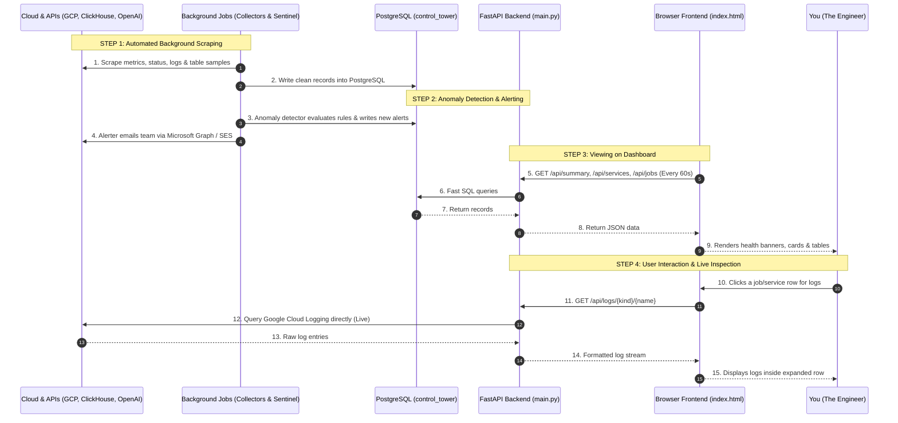

# Control Tower — System Architecture & Full Flow Guide (Frontend vs. Backend)

> **Purpose:** A complete, plain-English explanation of how Control Tower works from start to finish.
> This guide covers **where data comes from**, **where it is stored**, **how the backend processes it**, and **how the frontend displays it on your screen**.

---

## 1. The Big Picture: 30-Second Summary

Control Tower has **4 main building blocks**:

1. **The Outside World (What we watch):** Google Cloud Platform (Cloud Run, Schedulers), AWS, ClickHouse (business tables), Cloud Bills, and External APIs (OpenAI, Anthropic, BrightData).
2. **Background Workers (The Checkers):** Scheduled scripts running automatically in Google Cloud that go out, check everything, and write findings into our database.
3. **The Database (The Single Source of Truth):** One PostgreSQL database (`agenteye-pg`) that stores all health snapshots, alerts, costs, and AI catalog notes.
4. **The Web Dashboard (Frontend + Backend API):** A single web application where you view the health status, read live logs, and take action.

```
┌────────────────────────────────────────────────────────────────────────────────────────┐
│ 1. THE OUTSIDE WORLD (Observed Systems)                                                │
│    • Google Cloud (Cloud Run Services & Jobs, Schedulers, Cloud Logging)              │
│    • ClickHouse Cloud (Sales, Orders, Finance Tables)                                  │
│    • AWS (EC2, Cost Explorer) & Billing APIs (BigQuery, OpenAI, Anthropic, BrightData) │
└───────────────────────────────────────────┬────────────────────────────────────────────┘
                                            │
                                            ▼  (Scraped on fixed schedules)
┌────────────────────────────────────────────────────────────────────────────────────────┐
│ 2. BACKGROUND WORKERS (Cloud Run Jobs)                                                 │
│    • GCP Collector (Hourly)       ──► Checks apps, jobs, logs, status pages            │
│    • AWS Collector (Hourly)       ──► Checks EC2 instances                             │
│    • Cost Collector (Daily)       ──► Calculates daily spend across providers          │
│    • Sentinel Discovery (Daily)   ──► AI inspects ClickHouse tables & builds catalog   │
│    • Sentinel Check Engine(Daily) ──► Runs 5 data quality checks on ClickHouse         │
│    • Anomaly Detector (Hourly:30) ──► Detects spikes, slow runs, stuck/missed jobs     │
│    • Alerter (Hourly:45)          ──► Sends triage emails via MS Graph / SES           │
└───────────────────────────────────────────┬────────────────────────────────────────────┘
                                            │
                                            ▼  (Writes all findings)
┌────────────────────────────────────────────────────────────────────────────────────────┐
│ 3. STORAGE: ONE POSTGRESQL DATABASE (`agenteye-pg` -> `control_tower` DB)              │
│    • Schema `control_tower`: `service_health`, `alerts`, `cost_metrics`, `scheduler_jobs`│
│    • Schema `sentinel`: `catalog_overlay`, `check_results`, `incidents`, `rules`       │
└───────────────────────────────────────────┬────────────────────────────────────────────┘
                                            │
                                            ▼  (FastAPI queries DB / proxies live logs)
┌────────────────────────────────────────────────────────────────────────────────────────┐
│ 4. WEB APPLICATION (`ui/backend`)                                                      │
│    ┌──────────────────────────────────────────────────────────────────────────────┐    │
│    │ BACKEND (FastAPI: `main.py`)                                                 │    │
│    │ • Serves HTML dashboard at `GET /`                                           │    │
│    │ • Reads PostgreSQL and provides 15+ JSON endpoints at `/api/*`              │    │
│    │ • Connects live to Google Cloud Logging for on-demand log streaming          │    │
│    └──────────────────────────────────────┬───────────────────────────────────────┘    │
│                                           │ (JSON over HTTP)                           │
│                                           ▼                                            │
│    ┌──────────────────────────────────────────────────────────────────────────────┐    │
│    │ FRONTEND (Browser UI: `index.html` + Preact/htm in `vendor/`)                │    │
│    │ • 12 Interactive pages with instant hash routing (`#jobs`, `#alerts`)       │    │
│    │ • Auto-refreshes data every 60 seconds                                       │    │
│    │ • Clickable drawers, execution log selectors, 1-click Acknowledge/Resolve    │    │
│    └──────────────────────────────────────────────────────────────────────────────┘    │
└────────────────────────────────────────────────────────────────────────────────────────┘
```

---

## 2. Frontend vs. Backend: Who Does What?

To make it simple, think of **Backend** as the *Engine & Brain*, and **Frontend** as the *Steering Wheel & Screen*.

| Layer | Files | What It Does |
|---|---|---|
| **Frontend** (Runs in your Browser) | `ui/backend/index.html`<br>`ui/backend/vendor/*` | • Renders the visual dashboard (Dark/Light mode).<br>• Periodically asks backend for updates (`useApi` hook every 60s).<br>• Lets user sort tables, filter by search keywords, and expand rows.<br>• Sends user actions (e.g. clicking "Acknowledge" or "Resolve") to backend. |
| **Backend API** (Runs in Cloud Run: `ct-ui`) | `ui/backend/main.py` | • Connects directly to PostgreSQL to fetch metrics instantly.<br>• Connects live to Google Cloud Logging when a user clicks a row for logs.<br>• Executes SQL updates when users click buttons.<br>• Serves the HTML frontend with zero external dependencies. |
| **Background Collectors & AI** | `collectors/*`<br>`intelligence/*`<br>`sentinel/*` | • Run in the background on cron schedules (Cloud Schedulers).<br>• Pull raw data from GCP, AWS, ClickHouse, and APIs.<br>• AI analyzes business data and writes results to PostgreSQL. |

---

## 3. Where is Data Stored? (Storage Architecture)

Everything is stored in a single PostgreSQL 16 database (`control_tower`) hosted on Google Cloud SQL (`agenteye-pg`). It is cleanly partitioned into two schemas:

```
PostgreSQL Database: `control_tower`
│
├── 📁 Schema: `control_tower` (Infrastructure & Cloud Monitoring)
│   ├── 📄 `registered_services`  ── Master list of all known Cloud Run apps and jobs
│   ├── 📄 `service_health`       ── Hourly snapshots (traffic, errors, latency, CPU, instances, job status)
│   ├── 📄 `scheduler_jobs`       ── Master list of Cloud Schedulers and their cron expressions
│   ├── 📄 `provider_status`      ── Third-party status page results + BrightData balance
│   ├── 📄 `cost_metrics`         ── Daily cloud & AI token spend records
│   ├── 📄 `cost_budgets`         ── Monthly spend targets used to calculate budget burn %
│   └── 📄 `alerts`               ── History of all operational and data quality alerts
│
└── 📁 Schema: `sentinel` (AI Business Data Quality & Semantic Catalog)
    ├── 📄 `catalog_overlay`      ── AI semantic dictionary (what table is, grain, dedup key, quirks)
    ├── 📄 `monitor_targets`      ── Registered check targets and expected update cadences (e.g. daily/weekly)
    ├── 📄 `variable_values`      ── Tracked business dimension values (e.g. brand names, channels)
    ├── 📄 `reconciliation_rules` ── Mathematical consistency rules (e.g. segment vs total)
    ├── 📄 `check_results`        ── Audit history of all 5 check engine executions
    └── 📄 `incidents`            ── Open and resolved data quality incidents
```

---

## 4. Full Step-by-Step Flow (From Cloud to Screen)

Let's walk through how data actually moves through the system in real life across **4 distinct steps**:



---

### Step 1: Background Data Collection (How raw data enters the DB)

1. **Hourly Cloud Run Trigger:** Cloud Scheduler triggers `ct-gcp-collector` at minute `:00` of every hour.
2. **Auto-Discovery:** The collector queries the Google Cloud API for all Cloud Run services (using the `locations/-` global wildcard) and jobs (across 38 regions).
3. **Metric Gathering:**
   - For **Services:** Scrapes Google Cloud Monitoring for request counts, 5xx server errors, container instances, and latency percentiles (p50/p95).
   - For **Jobs:** Calls the Cloud Run Admin API (`run_v2.ExecutionsClient`) to retrieve the exact status (`succeeded`/`failed`), run duration, and completion time of the latest run.
   - For **Silent Failures:** Scans Cloud Logging for internal application error logs (`severity >= ERROR`) occurring even during `200 OK` HTTP responses.
4. **Third-Party & Billing Scraping:** Polls public status pages (OpenAI, Anthropic, GCP, Cloudflare), fetches BrightData live account balances, and queries BigQuery billing exports.
5. **Database Commit:** The collector writes structured records into `control_tower.service_health`, `control_tower.provider_status`, and `control_tower.cost_metrics` in safe batches.

---

### Step 2: Anomaly Detection & AI Sentinel Analysis

1. **Anomaly Detector (`ct-anomaly-detector`):** Runs at minute `:30` every hour. It scans `control_tower.service_health` in PostgreSQL for:
   - High error rate spikes (>5% and >2x baseline).
   - Abnormally slow jobs (>50% duration drift).
   - Missed cron schedules (job did not run when scheduled).
   - Silent application crashes & broken endpoints.
   - Any detected issue is inserted into `control_tower.alerts` (with a 4-hour deduplication window so you don't get spammed).
2. **Alerter (`ct-alerter`):** Runs at minute `:45`. It takes unacknowledged alerts from `control_tower.alerts`, asks Anthropic Claude for an instant 2-sentence root-cause summary, and sends an HTML email via Microsoft Graph API.
3. **Sentinel Data Engine (`ct-sentinel-discovery` & `ct-sentinel-check`):**
   - **Discovery:** AI inspects ClickHouse table schemas, infers business meaning, grain, deduplication keys, and registers check targets.
   - **Check Engine:** Runs daily checks for Data & Sync Freshness, Volume anomalies, Dimension Coverage (e.g. brand names), and cross-table Reconciliations.
   - Any data mismatch opens an incident in `sentinel.incidents` and bridges directly to `control_tower.alerts`.

---

### Step 3: Serving the Data via FastAPI Backend (`main.py`)

1. When you open the website, the browser loads the static shell from `GET /`.
2. The FastAPI backend connects to PostgreSQL using a high-performance connection pool (`psycopg2.extras.RealDictCursor`).
3. It exposes dedicated REST API endpoints:
   - `GET /api/summary`: Powers the top overview cards.
   - `GET /api/services`: Delivers request-driven service metrics.
   - `GET /api/jobs`: Delivers cron job statuses, durations, and last run dates.
   - `GET /api/sentinel/*`: Delivers AI catalog descriptions, review queue, coverage, and freshness data.
4. All database queries execute in milliseconds because they query indexed PostgreSQL tables rather than making live external cloud API calls.

---

### Step 4: Rendering & Interacting in Frontend (`index.html`)

1. **Zero-Build Architecture:** The frontend is built using **Preact** and **htm** (JSX syntax in plain JavaScript), served entirely from local files in `ui/backend/vendor/`. It requires no `npm build` step and has zero external CDN dependencies.
2. **Auto-Refresh Loop (`useApi` Hook):** Every 60 seconds, the frontend automatically re-fetches data in the background so the screen always reflects the latest state without manual page reloads.
3. **Instant Hash Navigation:** Clicking a sidebar tab changes the URL hash (e.g., `#services`, `#jobs`, `#alerts`), making tabs instantly linkable and persistent across page refreshes.
4. **Live Log Streaming On Click:**
   - When you click a job or service row, the frontend requests `GET /api/logs/{kind}/{name}`.
   - FastAPI reaches out directly to Google Cloud Logging, extracts the last 200 log entries, cleans up raw JSON audit messages, and streams them back to the frontend.
   - You can choose a specific past execution from a dropdown or toggle the "errors only" filter.
5. **1-Click Actions:**
   - **Acknowledge Alert:** Sends `POST /api/alerts/{id}/ack` $\to$ Backend updates `acknowledged_at = NOW()` $\to$ Badge disappears instantly.
   - **Confirm AI Catalog Table:** Sends `POST /api/sentinel/overlay/{db}/{tbl}/resolve` $\to$ Backend tags row as `updated_by='human'` $\to$ Future AI scans will never overwrite your approval.

---

## 5. Summary Diagram of Component Relationships

```
┌────────────────────────────────────────────────────────────────────────┐
│                              YOUR BROWSER                              │
│                      (Preact + htm + Local CSS)                        │
│                                                                        │
│   [Overview]   [Services]   [Jobs]   [Providers]   [Alerts]   [Costs]  │
│   [Catalog]    [Review]     [Cover]  [Reconcile]   [Fresh]    [Incid]  │
└───────────────────────────────────┬────────────────────────────────────┘
                                    │ (HTTP JSON API + 60s Polling)
                                    ▼
┌────────────────────────────────────────────────────────────────────────┐
│                          FASTAPI BACKEND (main.py)                     │
│                                                                        │
│  • /api/summary, /api/services, /api/jobs, /api/alerts, /api/sentinel  │
│  • Live Cloud Logging Proxy (/api/logs/*)                              │
│  • 1-Click Action Handlers (/api/alerts/ack, /api/sentinel/resolve)    │
└──────────────────┬─────────────────────────────────┬───────────────────┘
                   │ (Fast SQL Queries)              │ (Live Log Fetch)
                   ▼                                 ▼
┌─────────────────────────────────────┐   ┌──────────────────────────────┐
│       POSTGRESQL DATABASE           │   │     GOOGLE CLOUD LOGGING     │
│   • Schema `control_tower`          │   │  (Live container log stream) │
│   • Schema `sentinel`               │   └──────────────────────────────┘
└──────────────────▲──────────────────┘
                   │ (Writes hourly/daily snapshots)
┌──────────────────┴─────────────────────────────────────────────────────┐
│                    BACKGROUND RUNNERS & COLLECTORS                     │
│                                                                        │
│ • GCP Collector    • AWS Collector    • Cost Collector                 │
│ • Anomaly Detector • Alerter (Email)  • Sentinel Discovery & Checks    │
└────────────────────────────────────────────────────────────────────────┘
```
